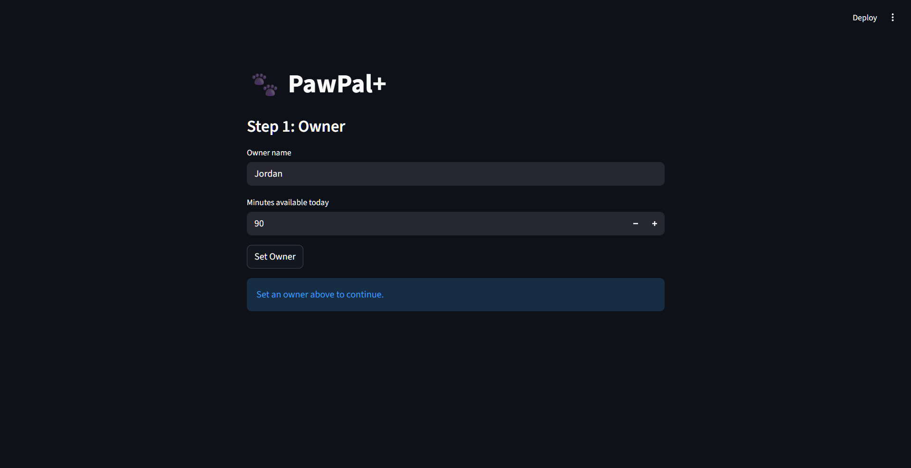
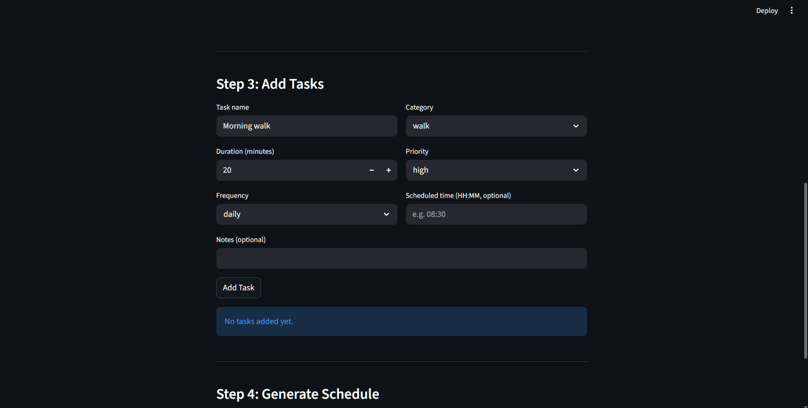
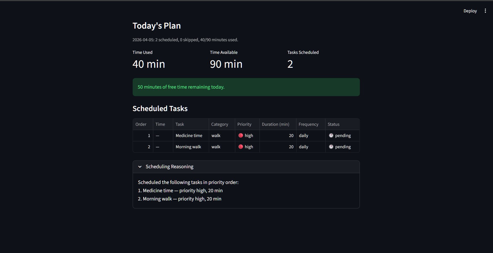

# PawPal+ Project Reflection

## 1. System Design

**a. Initial design**

- Briefly describe your initial UML design.
- What classes did you include, and what responsibilities did you assign to each?
Core Action
- add user and pet
- add tasks
- create scedules
1. User
name, time_available (minutes/day), preferences

2. Pet
name, species, owner

3. Task
name, category, duration, priority, pet, notes

4. ScheduledTask (new)
task, order, status

5. DailyPlan (replaces schedule)
date, user, pet, scheduled_tasks[], skipped_tasks[], time_available, time_used, reasoning
**b. Design changes**

- Did your design change during implementation?
- If yes, describe at least one change and why you made it.
-> removed priority from User
-> added priority and category in task
---

## 2. Scheduling Logic and Tradeoffs

**a. Constraints and priorities**

- What constraints does your scheduler consider (for example: time, priority, preferences)?
- How did you decide which constraints mattered most?

The scheduler considers time budget (owner's available minutes), task priority (high/medium/low), frequency (weekly tasks only run on Mondays), and optional fixed scheduled times. Time and priority came first because without them the schedule is meaningless — frequency and time slots are secondary refinements.

**b. Tradeoffs**

- Describe one tradeoff your scheduler makes.
- Why is that tradeoff reasonable for this scenario?

The scheduler uses a **greedy, priority-first packing algorithm** rather than checking for exact time-slot conflicts before scheduling. It fills the day by fitting the highest-priority tasks first until the time budget runs out — it does not try to rearrange lower-priority tasks around a conflict to find a valid combination.

This means conflict detection runs *after* the schedule is built, as a separate warning pass. Two tasks that overlap in time (e.g., "Morning walk" at 08:00 for 30 min and "Training session" at 08:15 for 20 min) will both be scheduled if there is enough total budget, and only then flagged with a warning. The scheduler does not automatically move one task to a different time to resolve the conflict.

This tradeoff is reasonable for a personal pet-care app because:
1. **Simplicity over perfection** — a greedy approach is easy to reason about and debug. Solving the full constraint-satisfaction problem (find a non-overlapping assignment that maximises priority) is NP-hard and unnecessary for a handful of daily tasks.
2. **Owner stays in control** — surfacing a warning and letting the owner decide whether to reschedule is more appropriate than silently reordering their tasks without explanation.
3. **Most tasks lack an exact time** — `scheduled_time` is optional. When tasks have no fixed time, overlap is undefined and the greedy order is the best available heuristic anyway.

---

## 3. AI Collaboration

**a. How you used AI**

- How did you use AI tools during this project (for example: design brainstorming, debugging, refactoring)?
- What kinds of prompts or questions were most helpful?

I used AI mostly for debugging and filling in boilerplate — things like wiring up Streamlit session state and writing the conflict-detection loop. The most useful prompts were specific: "given this class structure, write a greedy scheduler that sorts by priority then fits tasks until the time budget runs out." Vague prompts gave vague answers.

Copilot's inline autocomplete was most effective for repetitive patterns — once it saw one dataframe block in app.py it could predict the next one almost perfectly. The chat feature helped more for logic-heavy work like the scheduler loop and conflict detection.

**b. Judgment and verification**

- Describe one moment where you did not accept an AI suggestion as-is.
- How did you evaluate or verify what the AI suggested?

AI initially suggested resolving scheduling conflicts automatically by bumping task times. I rejected that — it would silently reorder the owner's day without explanation. Instead I kept the greedy pass and added a separate warning layer, which I verified by hand with overlapping test tasks to confirm warnings fired correctly.

**c. AI Strategy and Working with Copilot**

The model you use matters a lot. Better models hold context longer and hallucinate less — cheaper or older models would confidently suggest code that ignored constraints I had already defined. I learned to keep context tight: front-load only the class structure and the one specific task, not the whole project. Giving too much information early caused the AI to start making assumptions and filling in things I hadn't decided yet.

I also used separate chat sessions for different phases — one session for the data model, one for the scheduler logic, one for the Streamlit UI. This kept each conversation focused and prevented earlier decisions from bleeding into unrelated questions. When a session got long, the AI would start forgetting things I'd said at the start, or contradict its own earlier suggestions.

Even with good prompts, AI still hallucinates. It would sometimes "remember" a method I never wrote, or suggest a field that didn't exist in my classes. I had to stay the lead architect — every suggestion went through the filter of: does this fit the design I already committed to? AI is a fast typist, not a decision-maker. The moment I let it make structural choices without checking, things got messy fast.

---

## 4. Testing and Verification

**a. What you tested**

- What behaviors did you test?
- Why were these tests important?

I tested core scheduling (tasks sorted and packed by priority), time budget enforcement (tasks that don't fit get skipped), conflict detection (overlapping timed tasks raise warnings), frequency filtering (weekly tasks skipped on non-Mondays), and edge cases like zero tasks or a single task. These cover the main paths a real user would hit daily.

**b. Confidence**

- How confident are you that your scheduler works correctly?
- What edge cases would you test next if you had more time?

Fairly confident for the happy path. Edge cases I'd still want to cover: tasks whose duration exactly equals remaining time, two tasks with identical scheduled times, and an owner with zero minutes available.

---

## 📸 Demo

---

## 5. Reflection

**a. What went well**

- What part of this project are you most satisfied with?

The conflict-detection system. It's simple but genuinely useful — it doesn't hide problems, it surfaces them so the owner stays in control. That felt like the right call for this domain.

**b. What you would improve**

- If you had another iteration, what would you improve or redesign?

I'd add multi-pet support properly (right now only one pet is active at a time) and let the scheduler suggest alternative time slots when a conflict is detected rather than just warning.

**c. Key takeaway**

- What is one important thing you learned about designing systems or working with AI on this project?

AI is great at filling in structure but bad at knowing when *not* to add complexity. The most important judgment calls — like keeping conflict resolution manual — were ones I had to make myself. AI accelerates the build; the design decisions still need a human.
